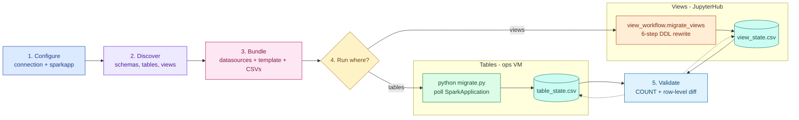

# 05_workflow — end-to-end flow

### Reading the diagram

1. **Configure** — Cell 1–2. Fill `connection` + `sparkapp`; `build_spark_session(...)` returns a dual-catalog Spark session (QA + prod).
2. **Discover** — Cell 3–5. Walk QA schemas, list tables, derive partition specs.
3. **Bundle** — Cell 6–9. Pick what to migrate, normalise into `datasources.json`, render `template.json`, write `sessions/<name>/` with two seeded CSV state trackers.
4. **Run** — bundle is self-contained. Tables go to the ops VM (`python migrate.py` polls the `SparkApplication` CR every 30s). Views run in-place from JupyterHub (`view_workflow.migrate_views` rewrites DDL and applies on the prod catalog).
5. **Validate** — `COUNT(*)` + row-level eqNullSafe diff. Verdict (`ok` / `mismatch` / `error`) is written back to the same CSVs.

### Conventions

- **Skip-success is the default** on both lanes. Wipe a status cell in JupyterLab (or pass `--rerun-all`) to retry.
- **CSV — not JSON.** JupyterLab's table viewer means no JSON editor needed for overrides.
- **One canonical migrate.py** at `migrate_template/migrate.py`; the bundle writer copies it per session.
